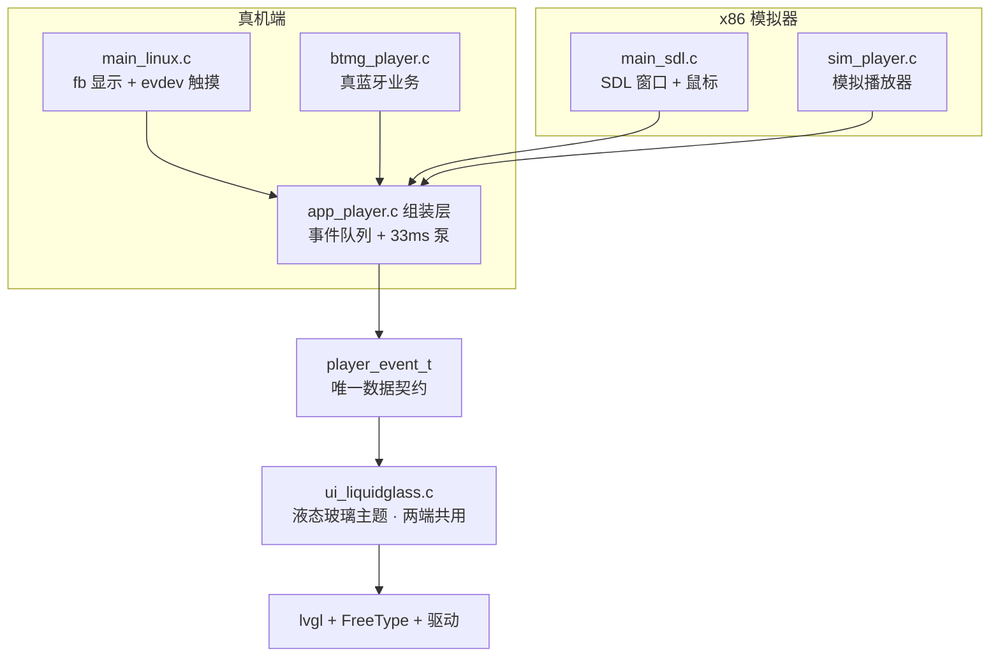

# T113 蓝牙音箱：从零到产品 · 课程大纲

> 本目录是"手把手从零写代码"教学课程的章节文档集合。
> 本章（00）是全课程总纲：课程怎么上、每章学什么、每章怎么验证。
> **本文件是教师视角的实施文档**；学员视角的逐章正文从 `01-*.md` 开始（陆续发布）。

---

## 一、这是一门什么课

我们用一块 149 元级的国产开发板 **T113-S3**，从第一行代码开始，做一个真正的产品：

**蓝牙音箱**——手机连上板子的蓝牙放歌，板子出声；板子上的 480×640 触摸屏实时显示
歌名、歌手、进度条、音量、唱盘旋转动画；屏幕上的按钮也能反向控制手机（播放/暂停/切歌）。

最终效果：

| 阶段 | 你能看到什么 |
|---|---|
| 第 11 章完成时（x86） | Ubuntu 上弹出 480×640 窗口：液态玻璃风格 UI，双曲轮播、进度推进、唱盘旋转、鼠标当手指点按钮 |
| 第 18 章完成时（真机） | 同样界面跑在开发板真屏上，手机真蓝牙连板子出声，屏显真实歌曲信息，双向控制 |

### 课程主线：先 x86 后真机

嵌入式开发最常见的痛苦是"改一行代码 → 交叉编译 → 部署到板子 → 出问题不知道错在哪"。
本课程刻意**反过来**：

1. **第二部分（第 3~11 章）全部在 Ubuntu 上写 UI**——用 SDL 模拟器窗口代替真屏，
   鼠标代替触摸，用一个"模拟播放器"代替真蓝牙。改代码 → 保存 → 重跑，秒级反馈。
2. **第四部分（第 13~18 章）再上板**——交叉编译、部署、接真蓝牙。
   因为 UI 和业务早已写好并验证，上板阶段每次只面对一个问题。

能做到这一点，靠的是项目一开始就定下的**分层架构**（后面每章都会用到这张图）：

**同一份 UI 代码**，配不同的"端口"（显示/触摸）和"后端"（业务），就能在 x86 和真机
上跑。课程第二部分你写的每一行 UI 代码，上板时一行都不用改。

### 学员前提与产出

- **前提**：会开关 Ubuntu 虚拟机/电脑，会打开终端敲命令（其余 Linux 知识第 0 章补齐）。
  硬件：上板篇需要一块已刷好固件、adb 可连的同款开发板（教师统一提供）。
- **系统**：Ubuntu 20.04 / 22.04 / 24.04 均可（差异点在各章明确标注，如第 0 章的
  FreeType 包名差异）。
- **语言**：C。不要求精通，但需知道指针、结构体、函数指针长什么样——
  用到的时候会现场讲（第 11 章的函数指针、第 9 章的回调）。
- **产出**：一套完整的嵌入式 GUI 产品代码 + 一套可复用的"先模拟后上板"开发方法论。

### 学习路线总览

```mermaid
flowchart LR
    subgraph P1[第一部分 环境 · 3 章]
        C0[第0章 总览与自检]
        C1[第1章 素材包与骨架]
        C2[第2章 交叉编译概念]
    end
    subgraph P2[第二部分 从零写 UI · 9 章 · 全程 x86]
        C3[第3章 第一个窗口]
        C4[第4章 中文字体]
        C5[第5章 背景图]
        C6[第6章 界面骨架]
        C7[第7章 歌曲信息]
        C8[第8章 双进度条]
        C9[第9章 控制按钮]
        C10[第10章 唱盘动画]
        C11[第11章 模拟播放器联动]
    end
    subgraph P3[第三部分 基础设施 · 1 章]
        C12[第12章 OSAL 与单元测试]
    end
    subgraph P4[第四部分 上板真蓝牙 · 6 章]
        C13[第13章 首次上板出图]
        C14[第14章 蓝牙概念与栈]
        C15[第15章 A2DP 出声]
        C16[第16章 AVRCP 元数据]
        C17[第17章 播放控制]
        C18[第18章 稳定性回归]
    end
    subgraph P5[第五部分 工程化 · 2 章]
        C19[第19章 CI 与产物]
        C20[第20章 总结与扩展]
    end
    P1 --> P2 --> P3 --> P4 --> P5
```

- 第一部分约 2 学时，第二部分每章 1.5~2 学时（合计约 16 学时），第三部分约 2 学时，
  第四部分每章 2 学时（合计约 12 学时），第五部分约 2 学时。总计 **30~35 学时**。
- **铁律：每章末尾的"验证"不通过，绝不进入下一章。** 每一章的验证都是具体命令 +
  预期输出，没有任何一章需要"感觉上应该对了"。

### 课程怎么上（学员须知）

1. 每章一个 md 文档（`docs/course/NN-标题.md`），文档里有：知识点讲解、完整代码
   （直接复制即可）、流程图、验证步骤、常见问题。**代码从文档复制，不要凭记忆敲**
   ——排错时才能确定错在环境而不是错在手误。
2. 每章开始前先看"本章目标"里的验证效果；每章结束必须跑通"验证"小节的所有命令。
3. 遇到问题先查本章"常见问题"小节，再查第 0 章的排错总表；都不行按文档方式
   收集信息（命令+输出）找教师。

---

## 二、写给教师（实施备注，学员可跳过）

### 与本仓库的映射

课程内容 = 把本仓库 M0→M10 的真实开发过程**反向展开**为教学路径：

| 部分 | 参照里程碑 | 参考实现（学员写完后可对照 diff） |
|---|---|---|
| 一（环境） | M9 工具链自举、M10 依赖 | `scripts/setup.sh`、`build.sh` |
| 二（UI） | M4a UI 初版 → M5 液态玻璃 → M10 模拟器 | `src/ui/`、`src/ports/sdl/`、`src/ui/theme.h` |
| 三（OSAL） | M6 分层重构 | `src/osal/`、`src/tests/` |
| 四（上板） | M1 蓝牙 bring-up → M7 回归 | `src/services/btmg_player.c`、`src/ports/main_linux.c`、`firmware/rtl8723ds/` |
| 五（工程化） | M10 CI + 产物分发 | `.github/workflows/build.yml` |

教学起点不是本仓库，而是"**素材包 + 空 src/ + 教师 CMake 骨架**"。学员的最终成品
应与参考实现逐文件 diff 只有注释级差异。

### 素材包（T113-Course-Materials-v1.zip）

学员无法从 md 文档"抄"出二进制素材，以下内容**教师私发**，第 1 章引导学员校验解压：

| 素材包内容 | 学员放置位置 | 首次使用章节 |
|---|---|---|
| `third_party/`（lvgl 8.3.1 / lv_drivers / freetype / bt 专有库） | 工程根/ | 第 3 章起 |
| `assets/fonts/SOURCEHANSANSCN_REGULAR.OTF`（8MB 思源黑体） | 工程根/assets/fonts/ | 第 4 章 |
| `assets/image/{bg,disc,bt}.png` | 工程根/assets/image/ | 第 5 章 |
| `firmware/rtl8723ds/`（实测好 BT 固件集 + md5 表） | 工程根/firmware/ | 第 14 章 |
| `cmake/openwrt-armhf.cmake`、`cmake/gnueabihf.cmake` | 工程根/cmake/ | 第 2/13 章 |
| `scripts/setup.sh`、`scripts/deploy.sh` | 工程根/scripts/ | 第 2/13 章 |
| `build.sh` | 工程根/ | 第 2 章 |
| **教学版 `CMakeLists.txt`**（与仓库成品版逻辑一致、注释加倍，逐段对应第 3 章讲解） | 工程根/ | 第 3 章 |
| 教师预置 `src/tests/{osal_test,sim_loop_test}.c`（第 2 章当黑盒，第 12 章转白盒） | 工程根/src/tests/ | 第 2 章 |
| `SHA256SUMS` 校验表 | — | 第 1 章 |

> btmg 专有库、RTL8723DS 固件不在任何公开仓库，仅随素材包私发。

### 批改与验收

- 每章验证命令可脚本化：x86 章节用 `SDL_VIDEODRIVER=dummy ./build/bt_speaker_sim -t 3`
  之类的无头冒烟；上板章节用 adb 命令序列。
- 学员成品与参考实现 diff 时，预期差异：注释、变量命名微调、（允许）素材路径宏覆盖。
- 第五部分可选做 GitHub Classroom 自动评测：学员 push 触发与本仓库相同的 CI 门禁。

### 备课注意

- 第 11 章先给 OSAL 队列**极简版**（仅 16 槽队列），完整 OSAL 到第 12 章——两章代码
  有意重叠，讲清"最小可用 → 工程完整"的演进。
- 第四部分每章的板端命令都基于已刷机 zgl_board（adb 连虚拟机 USB OTG）；换板型
  需自行核对显示/触摸/BT 节点。
- 各章"常见问题"来自本仓库真实踩坑记录（`docs/project-guide.md`），备课可交叉引用。

---

## 三、逐章大纲（每章卡片 = 未来章节 md 的骨架）

> 每张卡片五项：**目标 / 知识点 / 产出 / 验证 / 对照**。
> "对照"指学员写完后可与参考实现比对的仓库文件。

### 第一部分 · 环境准备（不写代码）

#### 第 0 章 课程总览与环境自检
- **目标**：跑通环境自检脚本；能说出课程两个最终效果分别长什么样。
- **知识点**：课程主线（先 x86 后真机）与分层架构图；Linux 最小命令集（cd/ls/tar/
  curl/apt/`echo $?`/权限）；Ubuntu 20/22/24 差异（20.04 装 `libfreetype6-dev`，
  22.04+ 装 `libfreetype-dev`）；git 最小集（init/add/commit/log/diff）。
- **产出**：无代码；`check_env.sh` 自检通过（gcc/cmake/make/SDL 依赖探测 + 结果解读）。
- **验证**：自检脚本每项输出 OK；`git init` 并完成首次空提交。
- **对照**：`docs/course/00-大纲.md`；排错总表见第 0 章正文（取材 project-guide §9）。

#### 第 1 章 素材包与工程骨架
- **目标**：素材包校验解压到位；理解"哪些是发给我的、各是什么"。
- **知识点**：vendor（第三方代码进仓库）的意义与代价；LVGL/lv_drivers/FreeType/bt
  四个 third_party 子目录各是什么；sha256 校验；工程目录约定（src/ui/ports/…，
  依赖只向下——先认路，第三/四部分才深入）。
- **产出**：工程骨架目录树成形；git 第二次提交（"第1章：素材包就位"）。
- **验证**：`sha256sum -c SHA256SUMS` 全 OK；目录树与文档截图一致；
  `ls third_party/` 四个子目录齐全。
- **对照**：仓库根目录树（README「目录结构」节）。

#### 第 2 章 交叉编译与工具链
- **目标**：装好工具链；理解"为什么不能直接用 apt 的 gcc 编板子程序"；host 自测首次全绿。
- **知识点**：交叉编译概念、主机三元组（x86_64/arm-openwrt-linux-）、**硬浮点 vs
  软浮点**（armhf 与板上 rootfs glibc 2.29 的 ABI 匹配，为什么 linaro 5.3.1 软浮点
  不可用）；`file` 命令看 ELF；setup.sh 走读（Release 下载裁剪版 204MB → 解压 →
  自检；断网回退 `TINA_SDK_PATH` 本地复制）；ctest 是什么。
- **产出**：`toolchain/` 就位；`./build.sh -host` 首次跑通（ctest 2/2 绿）。
- **验证**：`./toolchain/bin/arm-openwrt-linux-gcc --version` 出 gcc 8.3.0；
  `./build.sh -host` 末尾 `100% tests passed, 2 tests`。
- **对照**：`scripts/setup.sh`；`src/tests/`（此时黑盒）。

### 第二部分 · 从零写 UI（全程 x86 模拟器）

#### 第 3 章 第一个窗口 ⭐样章已写
- **目标**：从零写出 SDL 端口三件套，弹出 480×640 窗口；理解 LVGL 启动五步。
- **知识点**：CMake 目标/链接/include 路径三概念；SDL2 窗口模型（window→texture→
  渲染流）；LVGL 8.3 架构与启动流程（lv_conf.h→lv_init→注册 disp/indev 驱动→
  控件树→lv_timer_handler 死循环）；draw_buf 与 flush_cb（像素从内存到窗口的路）。
- **产出**：`src/ports/sdl/{lv_port_disp.c, lv_port_indev.c, main_sdl.c}`。
- **验证**：`./build.sh -sim` 弹 480×640 深色窗口；鼠标移动终端打印坐标；
  `./build/bt_speaker_sim -t 3` 退出码 0。
- **对照**：`src/ports/sdl/`（正文见 `03-第一个窗口.md`）。

#### 第 4 章 中文字体（FreeType 端口）
- **目标**：窗口里画出"蓝牙音箱 123"中英混排。
- **知识点**：位图字体 vs 矢量字体；FreeType 运行时加载（OTF→字形位图→缓存）；
  LV_USE_FREETYPE 配置；lv_font_t 是什么、字号 16/24 两份；为什么中文歌名必须
  这么做（LVGL 内置 Montserrat 无汉字）。
- **产出**：`src/ports/lv_port_font.c/.h`（dual-size 加载 + 探测降级）。
- **验证**：窗口显示中英混排两行字，字号差异清晰；删字体文件再跑 → 优雅降级不崩。
- **对照**：`src/ports/lv_port_font.c`。

#### 第 5 章 背景图与 PNG 解码
- **目标**：bg.png 铺满窗口。
- **知识点**：PNG 压缩原理（行滤波+DEFLATE→RGBA）；lodepng 解码流程；LVGL 文件
  系统（'S:' 盘符 / LV_USE_FS_POSIX）；**lodepng.c 宏坑**（`LV_USE_PNG` 不经
  lv_conf.h，需编译宏兜底——素材包 CMakeLists 已固化，本章讲为什么）；图片解码
  内存（LV_MEM_CUSTOM=1 用系统 malloc 的原因）；素材路径宏 BOARD_RES_PATH。
- **产出**：theme.h 初版（素材路径宏 + 色板常量）；main 里加载背景图。
- **验证**：480×640 窗口完整显示背景图；故意改错路径 → 启动不崩、按降级路径走。
- **对照**：`src/ui/theme.h`（部分）、`src/ports/sdl/main_sdl.c`。

#### 第 6 章 播放界面骨架（液态玻璃）
- **目标**：界面有了"骨架"——蓝牙胶囊区 + 状态点 + 玻璃拟态底板。
- **知识点**：液态玻璃设计语言（对照 docs/design/ 设计稿）；lv_obj 容器与样式系统
  （bg_opa/radius/border/shadow）；布局常量表先行（theme.h 加布局段）——
  为什么坐标要收口成常量而不是散在代码里。
- **产出**：theme.h 布局常量段；UI 骨架（胶囊容器、BT 图标、状态点）。
- **验证**：窗口出现半透明胶囊与状态点，位置与设计稿一致（截图对比）。
- **对照**：`src/ui/theme.h`、`src/ui/ui_liquidglass.c`（ui_init 前半）。

#### 第 7 章 歌曲信息区
- **目标**：歌名/歌手/专辑三行 + 时间显示就位。
- **知识点**：lv_label 长文本模式（LV_LABEL_LONG_DOT/SCROLL/WRAP 选型）；
  recolor；fmt_time（毫秒→mm:ss）；竖屏布局计算（黄金分割点位）。
- **产出**：song/artist/album 三 label + time label；theme.h 时间格式常量。
- **验证**：预填假数据显示"晴天 / 周杰伦 / 叶惠美 / 04:29"，长歌名截断不溢出。
- **对照**：`src/ui/ui_liquidglass.c`（apply_info/apply_song/fmt_time）。

#### 第 8 章 进度条与音量条
- **目标**：底部双条就位（播放进度 + 音量）。
- **知识点**：lv_bar vs lv_slider 选型（本页只读展示用 bar）；range/value/动画
  参数（LV_ANIM_ON 的观感与陷阱）；样式主件+指示器两段式定制。
- **产出**：进度条 + 音量条 + 百分比/时间标签联动。
- **验证**：假数据驱动：进度条走到约 1/3，音量 36%；拖动窗口无残影。
- **对照**：`src/ui/ui_liquidglass.c`（bar/vol_bar 创建段）。

#### 第 9 章 控制按钮
- **目标**：上一首/播放/下一首三按钮可点，按下有反馈。
- **知识点**：lv_btn 状态机（DEFAULT/CHECKED_PRESSED...）；事件回调机制
  （lv_event_cb + user_data 传参——C 里怎么把"哪个按钮"传进回调）；播放符号
  LV_SYMBOL_PLAY/PAUSE 是 FontAwesome 字形不是图片；乐观更新的第一课
  （点击瞬间切图标，先体验"为什么要这么快"）。
- **产出**：三按钮 + 回调占位（本章先打印日志，第 11 章接真命令）。
- **验证**：鼠标点击三按钮终端各打印一行；按下态视觉反馈明显。
- **对照**：`src/ui/ui_liquidglass.c`（btn_*_cb、play/pill 按钮创建）。

#### 第 10 章 唱盘与旋转动画
- **目标**：disc.png 唱盘持续旋转。
- **知识点**：lv_img 变换（pivot/angle/zoom）与旋转性能（LV_IMG_CACHE、
  anticipative 变换）；lv_timer（LVGL 的"心跳"——与 Sleep 循环的本质区别）；
  30fps 旋转 timer 与角度累加取模（0~3600，0.1° 单位）。
- **产出**：disc 图 + 旋转 timer（暂停态减速/停转留给第 11 章联动）。
- **验证**：唱盘匀速旋转无卡顿（截图两帧 diff 有变化）；CPU 占用可接受。
- **对照**：`src/ui/ui_liquidglass.c`（disc_timer_cb）。

#### 第 11 章 模拟播放器与完整联动 ⭐第二部分收官
- **目标**：x86 完整产品形态——UI 与"播放器"联动，双曲轮播、进度推进、
  点按钮真切歌，达到本课程 x86 里程碑（参考实现 M10 效果）。
- **知识点**：
  - **player_event_t 数据契约**：208B 定长值类型逐字段讲；`-1/空串 = 不更新`
    语义；为什么用值传递不用指针（线程安全+生命周期）。
  - **后端接口 player_backend_t**：init/cmd/query_state——UI 只认接口不认实现。
  - **sim_player.c 从零写**：pthread 线程、500ms tick 剧本（晴天/夜曲循环、
    1/3 处演示"手机端暂停 3s"）；函数指针表——第 9 章回调概念的正用。
  - **OSAL 队列极简版**：16 槽满丢最旧；为什么必须队列（生产者消费者 +
    线程边界）。
  - **app_player.c 组装层**：33ms lv_timer drain；**绝不能在 BT/模拟线程回调里
    直接碰 LVGL**（时序图：非线程安全 → 竞态 → 崩溃）。
  - **乐观更新**：点击秒切图标 + 事件回来校正——刻意的 UX 设计，勿"修复"。
- **产出**：`src/core/player_types.h`、`src/osal/osal.h + osal_posix.c(队列)`、
  `src/services/{player_backend.h, sim_player.c}`、`src/apps/app_player.c`、
  main_sdl.c 改为经组装层启动。
- **验证**：`./build.sh -sim` 完整演示：双曲轮播、进度推进、1/3 处自动暂停 3s、
  鼠标点按钮乐观秒切、曲末自动切歌；长时间跑（≥10 分钟）不崩不内存涨。
- **对照**：`src/core/`、`src/osal/`、`src/services/sim_player.c`、`src/apps/`。

### 第三部分 · 基础设施补全

#### 第 12 章 OSAL 完全体与单元测试
- **目标**：把第 11 章的极简队列扩成完整 OSAL，并给自己的代码写单元测试。
- **知识点**：OSAL 概念（上板后 POSIX/RTOS 差异为什么要抽象）；mutex/time/log
  逐个补全；队列"满丢最旧"策略的取舍（UI 场景丢位置不丢状态）；单元测试思想
  （测什么/怎么断言）；ctest 注册与运行；-Werror 纪律。
- **产出**：`src/osal/` 完全体；`src/tests/{osal_test, sim_loop_test}.c`
  （第 2 章的黑盒转白盒重写）。
- **验证**：`./build.sh -host` ctest 2/2 绿；故意在 osal_test 里断言失败看ctest
  如何报错；模拟器回归正常。
- **对照**：`src/osal/`、`src/tests/`。

### 第四部分 · 上板：真蓝牙（每章都含板端验证）

#### 第 13 章 首次交叉编译与部署（真机出图里程碑）
- **目标**：第 11 章的 x86 成品跑上真屏。
- **知识点**：目标板构建（openwrt-armhf.cmake 讲解：STAGING_DIR wrapper 注入坑）；
  `file build/bt_speaker` 断言 ARM hard-float；deploy.sh 走读：adb push 分发策略
  （大文件上 /mnt/UDISK，rootfs 只有 ~8MB；libbtmg→/lib、FreeType→/usr/lib）；
  start-stop-daemon 而非 nohup&（adb 会话退出杀进程坑）；板级端口替换：
  fb 显示端口（**BGRX 字节序坑**）、evdev 触摸端口（设备节点探测 event4）。
- **产出**：`src/ports/lv_port_disp.c`（fb 版）、`lv_port_indev.c`（evdev 版）、
  `src/ports/main_linux.c`。
- **验证**：`adb shell "ps | grep bt_speaker"` 有进程；板屏显示与模拟器一致
  （sim 剧本照跑）；触摸点按钮有反应。
- **对照**：`src/ports/lv_port_{disp,indev}.c`、`main_linux.c`、`scripts/deploy.sh`。

#### 第 14 章 蓝牙基础概念与蓝牙栈
- **目标**：板子蓝牙起来（hci0 UP），能被手机发现。
- **知识点**：蓝牙协议分层小白讲（控制器/主机）；经典蓝牙 vs BLE；本产品用到的
  profile 角色表（A2DP Sink/AVRCP Target）；**板上蓝牙栈全景**：RTL8723DS 驱动
  →H4 HCI→bluez bluetoothd→bluealsa(SBC 解码)→ALSA；libbtmg 是 bluez 之上的
  封装（btmanager 4.0.3）；hciconfig/btmgmt 工具；固件加载（firmware/rtl8723ds/
  的 md5 表——"好的版本集"概念）。
- **产出**：无新代码；BT 固件/配置核对。
- **验证**：`adb shell hciconfig hci0` → `UP RUNNING PSCAN ISCAN`（ACL MTU 1021）；
  手机蓝牙列表能看到板子。
- **对照**：`firmware/rtl8723ds/`（README md5 表）。

#### 第 15 章 A2DP 出声
- **目标**：手机连板子，音乐从板子喇叭出声。
- **知识点**：A2DP 协议流（Source→Sink，SBC 编解码）；btmg API 家族
  （btmg_adapter/btmg_a2dp/btmg_core）；**preinit 时序**（为什么要在蓝牙服务
  起来前后分步注册）；btmg_player.c 上半：preinit→A2DP Sink 注册→回调框架
  （此时回调只打印日志）；音频路由 ALSA default→片内 codec。
- **产出**：`src/services/btmg_player.c`（前半）+ main_linux.c 换真后端。
- **验证**：手机配对连接 → 板子出声；`adb logcat`/串口日志见回调打印；
  UI 显示已连接状态点变绿。
- **对照**：`src/services/btmg_player.c`。

#### 第 16 章 AVRCP 元数据与进度
- **目标**：屏显真实歌名/歌手/进度/音量。
- **知识点**：AVRCP 是什么（和 A2DP 分工：控制面 vs 数据面）；btmg AVRCP 回调组
  （track_change/position/play_status/volume）逐个讲；**线程边界图**：btmanager
  回调线程 → 组 player_event_t → emit 入队 → LVGL drain（第 11 章架构图的正用）；
  事件合并策略（position 刷新率高，怎么防 UI 抖）。
- **产出**：btmg_player.c 下半（回调组事件 → emit）。
- **验证**：手机播真实歌曲，屏显歌名/进度实时推进；暂停/继续屏显同步；音量
  手机侧调整屏显跟随。
- **对照**：`src/services/btmg_player.c`。

#### 第 17 章 播放控制与音量
- **目标**：屏幕按钮反向控制手机（双向闭环）。
- **知识点**：AVRCP 下行命令（play/pause/next/prev）；绝对音量协议（Abs Volume
  同步双向）；**swap 抖动防护**（BT 栈对同一事件可能回调两次——去重策略）；
  完整交互回归清单（手机操作→屏显；屏按钮→手机，双向各 6 项）。
- **产出**：btmg_player.c cmd 路径完成；ui 回调接真命令（第 9 章占位的收官）。
- **验证**：双向控制 6 项全过；快速连点无状态错乱；手机切歌屏显跟随 <1s。
- **对照**：`src/services/btmg_player.c`、`src/ui/ui_liquidglass.c`（cmd 路径）。

#### 第 18 章 板上回归与稳定性
- **目标**：把项目从"能演示"打磨到"敢交付"。
- **知识点**（全部为真实踩坑复盘）：
  - 长歌名自适应（滚动/截断策略实测）。
  - **暂停态切歌图标 bug 复盘**（M7 案件：乐观更新与事件校正的时序竞态——
    教学案例级）。
  - 烧录固件后 libbtmg.so 版本回退坑（镜像 4.0.5 有 PIN bug vs 4.0.3 good 版，
    md5 验证法）。
  - 换 BT 固件/配置必须拔电 15s（RTL8723DS 常供电无复位脚，软 reboot 不清模块
    RAM → H5 sync timed out）。
  - `adb pull /dev/fb0` 抓帧分析（字节序 BGRX、前 480×640×4 字节为可见页）——
    没有屏幕截图工具时的"屏显急救包"。
- **产出**：bugfix 提交若干；稳定性检查单。
- **验证**：连续播放 1h 无崩溃；重启 10 次全部正常出图出声；长歌名不破版。
- **对照**：`docs/project-guide.md` §6/§9。

### 第五部分 · 工程化收尾

#### 第 19 章 CI 与产物分发
- **目标**：push 自动编译+测试，产出可下载产物。
- **知识点**：GitHub Actions 概念（workflow/job/step/runner）；build.yml 双 job
  设计（arm 门禁 + host 可移植层门禁）；**YAML 冒号坑实战**（`echo "OK: x"`
  使整个 workflow 无效、jobs 列表为空——真实事故复盘）；upload-artifact 与
  相对路径素材（编译期绝对路径烤死产物的坑）；本地 `yaml.safe_load` 预校验习惯。
- **产出**：学员仓库自己的 `.github/workflows/build.yml`。
- **验证**：push 后双 job 绿；Actions 页面能下载 ARM 程序与 x86 模拟器两个产物；
  故意改坏 YAML 观察"无 jobs 直接 failure"现象并修复。
- **对照**：`.github/workflows/build.yml`。

#### 第 20 章 总结与扩展方向
- **目标**：架构全景复盘；知道自己下一步能做什么。
- **知识点**：分层架构终局图（依赖只向下、唯一数据契约、端口可替换）；方法论
  总结（先模拟后上板/里程碑制/乐观更新/素材 vendor 化）；扩展练习清单：
  歌词显示（LRC 解析）、多设备管理、EQ、蓝牙 HID 遥控、M4b 开机自启
  （start-stop-daemon + init 脚本，作为毕业作业）。
- **产出**：毕业作业——任选一个扩展实现。
- **验证**：作业答辩清单（演示+代码走读+踩坑讲述）。
- **对照**：全仓库。

---

## 四、章节文件命名规范

- `docs/course/NN-标题.md`（NN 两位数，标题中文，如 `03-第一个窗口.md`）。
- 每章正文固定七段：**本章目标（验证先行）/ 知识点讲解（含 mermaid）/ 动手实现
  （完整代码，可直接复制）/ 代码讲解 / 验证 / 常见问题 / 小结与预告**。
- 全部代码块标注文件路径；涉及 Ubuntu 版本差异处用引用块标注（> ⚠ Ubuntu 20.04 …）。
