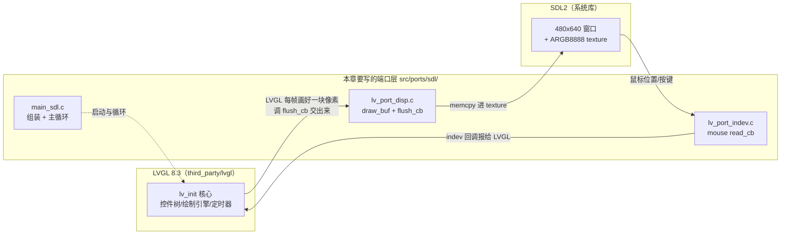
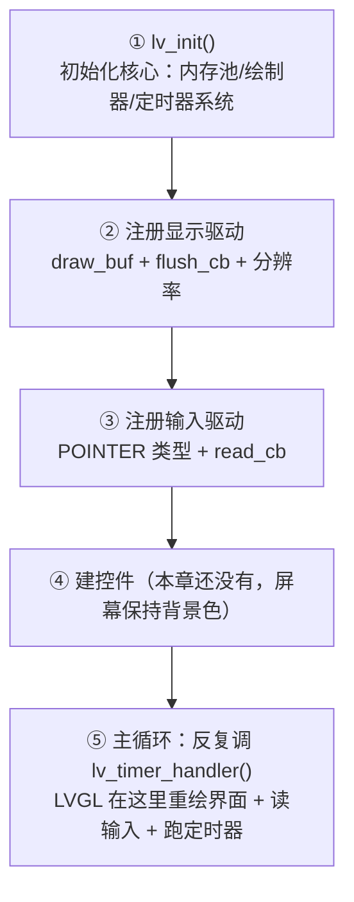
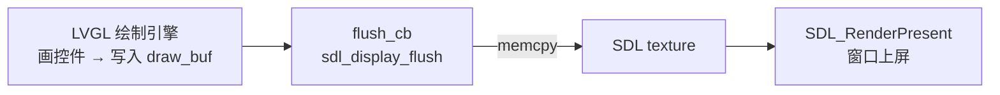
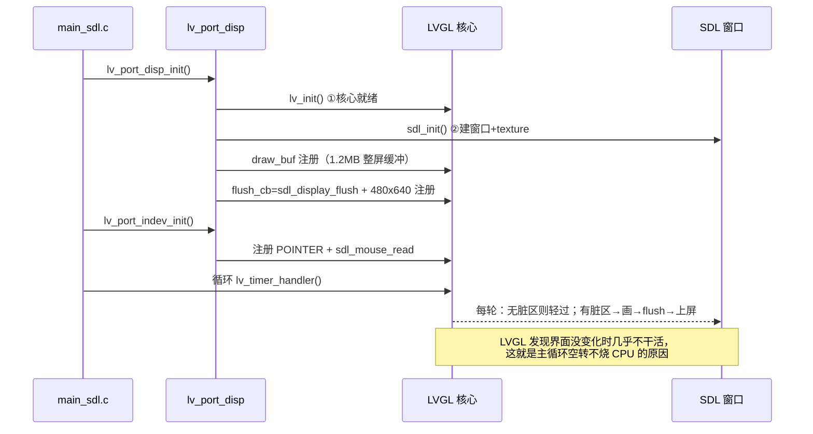

# 第 3 章 · 第一个窗口

> 📍 学习路线：第 2 章我们装好了交叉工具链、跑通了 host 自测。
> 本章开始**真正写代码**：从零做出一个 480×640 的窗口——它就是开发板屏幕的替身。
> 以后整套界面都先在这个窗口里做，做完才上板。

---

## 3.0 本章目标（先看要做出什么）

本章结束时，运行程序你会得到一个 **480×640 的窗口**（与开发板屏幕同尺寸）。
还没有画任何东西，所以它是纯色（浅灰）背景；鼠标在窗口里按住拖动时，终端打印坐标。

**本章产出：**

| 文件 | 作用 |
|---|---|
| `src/ports/sdl/lv_drv_conf.h` | SDL 驱动配置：分辨率 480×640、`USE_SDL=1` |
| `src/ports/sdl/lv_port_disp.c` | 显示端口：把 LVGL 画完的一帧交给 SDL 窗口 |
| `src/ports/sdl/lv_port_indev.c` | 输入端口：把鼠标变成"触摸屏" |
| `src/ports/sdl/main_sdl.c` | 程序入口：启动 LVGL → 注册端口 → 主循环 |

**验证方式（本章做完必须全部通过）：**

```bash
./build.sh -sim                 # ① 弹出 480×640 窗口，浅灰背景
./build/bt_speaker_sim -t 3     # ② 跑 3 秒自动退出，终端打印 "sim: exit after 3s"
echo $?                         # ③ 输出 0
```

> 💡 `-t 3` 是我们自己实现的"冒烟模式"：跑 N 秒自动退出。
> 它现在方便你自动化验证，第 19 章还会成为 CI 无人值守测试的基石。

---

## 3.1 知识点讲解

### 3.1.1 我们要造的东西：三层结构

一个 LVGL 程序 = **GUI 库 + 显示驱动 + 输入驱动**。LVGL 只负责"画"，它自己不知道
屏幕长什么样——你通过"驱动注册"告诉它。本章的三层：



**为什么屏幕是 480×640？** 开发板的屏就是 480 宽 × 640 高的竖屏。模拟器窗口做得
和它一模一样，UI 布局两端才完全通用——这是本课程"先 x86 后真机"路线的根基。

### 3.1.2 CMake：为什么不用手写编译命令

裸 gcc 编一个小程序：`gcc main.c -o main` 就行。但我们的程序要：

- 编译 **LVGL 上百个 .c**（third_party/）+ 我们的几个 .c；
- 告诉每个文件去哪找头文件（`-I` 路径一长串）；
- 链接 SDL2 等系统库。

手写这些命令既长又容易错，换台电脑还要重写。**CMake** 的思路：你写一份
`CMakeLists.txt` 描述"有哪些源文件、头文件在哪、链接什么库"，CMake 据此生成
Makefile，`make` 真正编译。三个最核心的概念，本章就会用到：

| 概念 | 命令 | 作用 |
|---|---|---|
| 目标 target | `add_executable(名字 源文件...)` | 要产出的一个程序/库 |
| 头文件路径 | `target_include_directories(名字 PRIVATE 目录...)` | `#include` 去哪找 |
| 链接库 | `target_link_libraries(名字 库...)` | 链接谁（SDL2、LVGL、pthread） |

> 💡 本课程不深抠 CMake 语法，CMakeLists 以**教师提供、带注释的骨架**为基础做增量。
> 你要能看懂、会加文件，不要求从零写出全部。

### 3.1.3 SDL2：窗口从哪来

Linux 下直接画窗口要用 X11/Wayland 协议，很繁琐。**SDL2** 把这些封装成统一 API：
`SDL_CreateWindow()` 建窗口、texture 当画布、`SDL_RenderCopy()` 上屏。
我们**不直接调**这些 API——`third_party/lv_drivers/sdl/sdl.c`（LVGL 官方驱动）
已经全部封装好，暴露给我们三个函数：

| 驱动函数 | 干什么 | 我们在哪调它 |
|---|---|---|
| `sdl_init()` | 建窗口 + 建 texture | `lv_port_disp_init()` 里 |
| `sdl_display_flush()` | 把 LVGL 画好的一帧 memcpy 进 texture | 注册为 flush_cb，LVGL 自动调 |
| `sdl_mouse_read()` | 读鼠标位置/按键 | 注册为 read_cb，LVGL 自动调 |

> ⚠ 素材包里的 `third_party/lv_drv_conf.h` 是**板上配置**（`USE_SDL=0`，编译出来是空壳）。
> 我们在 `src/ports/sdl/` 下放一份**自己的** `lv_drv_conf.h`（`USE_SDL=1`），
> 用 include 路径让 host 编译时命中它——板子构建不看这个目录，互不影响。
> 这是"同一套驱动代码，两份配置"的技巧。

### 3.1.4 LVGL 启动五步（背下来，全课程反复出现）



第⑤步的关键认识：**`lv_timer_handler()` 不是"画一次"就完，它每次只干"现在该干的活"**
（比如重绘脏区域、读一次鼠标），所以主循环要不停地调它，中间 `usleep` 让出 CPU。

### 3.1.5 draw_buf 与 flush_cb：像素的去向

LVGL 画图不是直接画到屏幕，而是先画进一块内存 **draw_buf**（渲染缓冲），
画完一块就调你注册的 **flush_cb**（回调函数）说"这块画好了，请送出去"。

- 板子上：flush_cb 把像素写进 `/dev/fb0`（framebuffer，第 13 章的事）；
- 本章：flush_cb 就是 vendor 驱动的 `sdl_display_flush`，它把像素 memcpy 进
  SDL texture，SDL 再显示到窗口。

我们的 draw_buf 开成**整屏大小**（480×640×4 字节 ≈ 1.2MB），一帧一块，简单直接。



### 3.1.6 tick：LVGL 的手表

LVGL 的动画、长按判定、输入采样都依赖"现在几点"。它要你提供一个毫秒时基：
`lv_conf.h` 已配好 `LV_TICK_CUSTOM=1`，它会反复调你实现的 **`custom_tick_get()`**
（返回开机以来的毫秒数）。我们用 `gettimeofday()` 实现它——三个端口文件之一的小角色。

---

## 3.2 动手实现

> 以下每个文件**整段复制**到对应路径即可。代码里保留教学注释，建议边复制边读。

### 3.2.1 前置检查

```bash
cd ~/t113-course          # 你的工程根目录（第 1 章建好的），应能看到：
ls                        # assets  build.sh  cmake  CMakeLists.txt  scripts  src  third_party
dpkg -l | grep libsdl2-dev | head -1    # 应输出 ii  libsdl2-dev ...（第 0 章装的）
```

`src/` 目前只有一个 `tests/`（教师预置的自测）。本章开始我们在 `src/ports/` 下攒自己的代码。

### 3.2.2 文件一：`src/ports/sdl/lv_drv_conf.h`（SDL 驱动配置）

```bash
mkdir -p src/ports/sdl
```

```c
/* src/ports/sdl/lv_drv_conf.h — host/SDL 模拟器专用驱动配置
 *
 * 只在 x86 模拟器构建中生效：编译 lv_drivers/sdl/sdl.c 时给 include 路径
 * 指向本目录，它 #include "lv_drv_conf.h" 就会命中本文件（USE_SDL=1）。
 * 板上构建不编译 sdl 驱动，third_party/ 里那份（USE_SDL=0）不受影响。
 */
#ifndef LV_DRV_CONF_H
#define LV_DRV_CONF_H

#include "lv_conf.h"   /* LVGL 主配置（src/ports/ 下，第 3.3 节讲 include 路径） */

/* ---- 其他硬件接口（SPI/I2C 并口小屏等）本课程用不到，全部留空 ---- */
#define LV_DRV_DELAY_INCLUDE  <stdint.h>
#define LV_DRV_DELAY_US(us)
#define LV_DRV_DELAY_MS(ms)
#define LV_DRV_DISP_INCLUDE         <stdint.h>
#define LV_DRV_DISP_CMD_DATA(val)
#define LV_DRV_DISP_RST(val)
#define LV_DRV_DISP_SPI_CS(val)
#define LV_DRV_DISP_SPI_WR_BYTE(data)
#define LV_DRV_DISP_SPI_WR_ARRAY(adr, n)
#define LV_DRV_DISP_PAR_CS(val)
#define LV_DRV_DISP_PAR_SLOW
#define LV_DRV_DISP_PAR_FAST
#define LV_DRV_DISP_PAR_WR_WORD(data)
#define LV_DRV_DISP_PAR_WR_ARRAY(adr, n)
#define LV_DRV_INDEV_INCLUDE     <stdint.h>
#define LV_DRV_INDEV_RST(val)
#define LV_DRV_INDEV_IRQ_READ    0
#define LV_DRV_INDEV_SPI_CS(val)
#define LV_DRV_INDEV_SPI_XCHG_BYTE(data)  0
#define LV_DRV_INDEV_I2C_START
#define LV_DRV_INDEV_I2C_STOP
#define LV_DRV_INDEV_I2C_RESTART
#define LV_DRV_INDEV_I2C_WR(data)
#define LV_DRV_INDEV_I2C_READ(last_read)  0

/* ---- SDL 驱动开关（本章的主角） ---- */
#define USE_SDL 1
#if USE_SDL
#  define SDL_HOR_RES     480    /* 窗口宽 = 板上屏宽 */
#  define SDL_VER_RES     640    /* 窗口高 = 板上屏高 */
#  define SDL_ZOOM        1      /* 窗口放大倍数，1 = 原始尺寸 */
#  define SDL_DOUBLE_BUFFERED 0  /* 双缓冲实验开关，不用 */
#  define SDL_INCLUDE_PATH    <SDL2/SDL.h>
#  define SDL_DUAL_DISPLAY    0
#endif

#endif /* LV_DRV_CONF_H */
```

> 💡 注意 `SDL_HOR_RES/SDL_VER_RES` 是 480×**640**——宽在高前，竖屏。

### 3.2.3 文件二：`src/ports/sdl/lv_port_disp.c`（显示端口）

```c
/* src/ports/sdl/lv_port_disp.c — 显示端口：SDL 窗口
 *
 * 职责：lv_init → sdl_init（建窗口）→ 开 draw_buf → 注册 flush_cb。
 * LV_COLOR_DEPTH 32（见 lv_conf.h）下 lv_color_t 正好 4 字节，与 SDL 的
 * ARGB8888 texture 天然同格式，flush 就是 memcpy。
 */
#include "../lv_port_disp.h"          /* 接口声明（第 1 章素材包已给） */
#include "lvgl/lvgl.h"
#include "lv_drivers/sdl/sdl.h"       /* sdl_init / sdl_display_flush */

#include <stdio.h>
#include <stdlib.h>                   /* malloc */

int lv_port_disp_init(void)
{
    static lv_disp_drv_t disp_drv;    /* 驱动描述符：static 保证生命周期贯穿全程序 */

    /* ① LVGL 核心：内存/绘制器/定时器系统（必须是第一个调的 LVGL 函数） */
    lv_init();

    /* ② vendor SDL 驱动：建 480x640 窗口 + ARGB8888 texture */
    sdl_init();

    /* ③ 渲染缓冲：整屏大小，LVGL 画完一帧由 flush 送走 */
    static lv_color_t *buf;
    buf = (lv_color_t *)malloc(SDL_HOR_RES * SDL_VER_RES * sizeof(lv_color_t));
    if (buf == NULL) {
        printf("malloc draw buffer fail\n");
        return -1;
    }
    static lv_disp_draw_buf_t disp_buf;
    lv_disp_draw_buf_init(&disp_buf, buf, NULL, SDL_HOR_RES * SDL_VER_RES);

    /* ④ 注册显示驱动：分辨率 + flush 回调 */
    lv_disp_drv_init(&disp_drv);
    disp_drv.draw_buf = &disp_buf;
    disp_drv.flush_cb = sdl_display_flush;   /* LVGL 画好一块 → SDL 上屏 */
    disp_drv.hor_res = SDL_HOR_RES;
    disp_drv.ver_res = SDL_VER_RES;
    lv_disp_drv_register(&disp_drv);

    printf("sdl: %dx%d window\n", SDL_HOR_RES, SDL_VER_RES);
    return 0;
}

void lv_port_disp_exit(void)
{
    /* 窗口清理由 SDL 驱动在退出路径自行处理 */
}
```

### 3.2.4 文件三：`src/ports/sdl/lv_port_indev.c`（输入端口）

```c
/* src/ports/sdl/lv_port_indev.c — 输入端口：SDL 鼠标（鼠标 = 板上触摸）
 *
 * 注册一个 POINTER（指针类）输入设备，read_cb 用 vendor 驱动的
 * sdl_mouse_read：LVGL 会周期性调它问"鼠标现在在哪、按没按"。
 */
#include "../lv_port_indev.h"         /* 接口声明（第 1 章素材包已给） */
#include "lvgl/lvgl.h"
#include "lv_drivers/sdl/sdl.h"

int lv_port_indev_init(void)
{
    static lv_indev_drv_t indev_drv;
    lv_indev_drv_init(&indev_drv);
    indev_drv.type    = LV_INDEV_TYPE_POINTER;
    indev_drv.read_cb = sdl_mouse_read;   /* 鼠标左键按下 = 手指触摸 */
    lv_indev_drv_register(&indev_drv);
    return 0;
}
```

### 3.2.5 文件四：`src/ports/sdl/main_sdl.c`（程序入口）

```c
/* src/ports/sdl/main_sdl.c — x86 模拟器入口
 *
 * 组装：LVGL 显示/输入端口 → tick → 主循环。
 * （第 4 章在这里加字体，第 11 章加 UI 主题与模拟播放器——组装顺序从现在
 *   就与板上 main_linux.c 保持一致，将来上板只换端口不换顺序。）
 *
 * 用法：bt_speaker_sim [-t 秒]     -t N：跑 N 秒自动退出（冒烟验证）
 */
#include "lvgl/lvgl.h"
#include "lv_port_disp.h"
#include "lv_port_indev.h"

#include <unistd.h>
#include <stdlib.h>
#include <stdio.h>
#include <string.h>
#include <sys/time.h>

/* ---- LVGL 时基：开机以来的毫秒数（lv_conf.h 的 LV_TICK_CUSTOM 会调它） ---- */
uint32_t custom_tick_get(void)
{
    static uint64_t start_ms = 0;                 /* 首次调用记录起点 */
    struct timeval tv;
    gettimeofday(&tv, NULL);
    uint64_t now_ms = ((uint64_t)tv.tv_sec * 1000000 + (uint64_t)tv.tv_usec) / 1000;
    if (start_ms == 0)
        start_ms = now_ms;
    return (uint32_t)(now_ms - start_ms);
}

int main(int argc, char *argv[])
{
    /* 解析 -t <秒>：冒烟模式，N 秒后自动退出 */
    int smoke_s = 0;
    for (int i = 1; i + 1 < argc; i += 2) {
        if (strcmp(argv[i], "-t") == 0)
            smoke_s = atoi(argv[i + 1]);
    }

    /* ① 显示端口：lv_init + SDL 窗口 + draw_buf/flush_cb */
    if (lv_port_disp_init() != 0)
        return 1;

    /* ② 输入端口：鼠标 = 触摸 */
    lv_port_indev_init();

    /* ③ 控件（本章还没有；屏幕保持主题背景色） */

    /* ④ 主循环：lv_timer_handler 干活 → usleep 让 CPU 喘气 */
    uint32_t deadline_ms = smoke_s ? custom_tick_get() + (uint32_t)smoke_s * 1000 : 0;
    while (1) {
        uint32_t time_till_next = lv_timer_handler();
        usleep((time_till_next > 0 ? time_till_next : 1) * 1000);
        if (smoke_s && custom_tick_get() >= deadline_ms)
            break;
    }

    printf("sim: exit after %ds\n", smoke_s);
    lv_port_disp_exit();
    return 0;
}
```

### 3.2.6 CMakeLists.txt：加模拟器目标

素材包的 `CMakeLists.txt` 已经能编第 2 章的 host 自测。本章在**末尾**加模拟器部分
（完整上下文见文档附带的教师注释版；你只需追加 `###` 以下的段落）：

```cmake
# ================= x86 SDL 模拟器（第 3 章起） =================
# 需要 libsdl2-dev + libfreetype-dev（第 0 章装好）。

find_package(Freetype REQUIRED)
find_package(SDL2 REQUIRED)

# vendor 里 LVGL 全部源码编成静态库 lvgl
file(GLOB_RECURSE LVGL_SOURCES ${PROJECT_SOURCE_DIR}/third_party/lvgl/src/*.c)
add_library(lvgl STATIC ${LVGL_SOURCES})
target_include_directories(lvgl SYSTEM PUBLIC
    ${PROJECT_SOURCE_DIR}/third_party            # lvgl.h 在 third_party/lvgl/…（含 lvgl/lvgl.h 双层）
    ${PROJECT_SOURCE_DIR}/src/ports              # 让 lvgl 找到我们的 lv_conf.h
    ${PROJECT_SOURCE_DIR}/third_party/lvgl/src/extra/libs/freetype
    ${FREETYPE_INCLUDE_DIRS})                    # ft2build.h（系统 FreeType 头）
target_link_libraries(lvgl PUBLIC Freetype::Freetype)
# ↑ 为什么第 3 章就要链 FreeType（第 4 章才用字体）？
#   lv_conf.h 开着 LV_USE_FREETYPE=1，lvgl 源码里的 lv_freetype.c 就要编，
#   它需要 FreeType 的头（ft2build.h）和库。先照抄，第 4 章讲字体时回看就懂了。

# vendor 的 SDL 驱动（sdl.c/sdl_common.c）：原本是空壳，
# 给 LV_CONF_INCLUDE_SIMPLE + 指向 src/ports/sdl 的头文件路径，
# 让它的 #include "lv_drv_conf.h" 命中我们的 USE_SDL=1 版 → 点亮
add_library(sdl_drv STATIC
    ${PROJECT_SOURCE_DIR}/third_party/lv_drivers/sdl/sdl.c
    ${PROJECT_SOURCE_DIR}/third_party/lv_drivers/sdl/sdl_common.c)
target_compile_definitions(sdl_drv PRIVATE LV_CONF_INCLUDE_SIMPLE)
target_include_directories(sdl_drv SYSTEM PRIVATE
    ${PROJECT_SOURCE_DIR}/src/ports/sdl          # 我们的 lv_drv_conf.h
    ${PROJECT_SOURCE_DIR}/third_party)           # sdl.h 里的 "lvgl/lvgl.h"
target_link_libraries(sdl_drv PUBLIC lvgl SDL2::SDL2)

# 模拟器主程序
add_executable(bt_speaker_sim
    src/ports/sdl/main_sdl.c
    src/ports/sdl/lv_port_disp.c
    src/ports/sdl/lv_port_indev.c)
target_compile_definitions(bt_speaker_sim PRIVATE LV_CONF_INCLUDE_SIMPLE)
target_include_directories(bt_speaker_sim PRIVATE
    ${PROJECT_SOURCE_DIR}/src/ports              # lv_port_*.h
    ${PROJECT_SOURCE_DIR}/src/ports/sdl          # host lv_drv_conf.h
    ${PROJECT_SOURCE_DIR}/third_party)
target_link_libraries(bt_speaker_sim PRIVATE lvgl sdl_drv m)
```

三处易错点，提前说明：

1. **`LV_CONF_INCLUDE_SIMPLE` 出现了两次**（sdl_drv 和 bt_speaker_sim）。
   它的意思是"用简单方式找配置头文件"。sdl.c 靠它找到我们的 `lv_drv_conf.h`；
   主程序里的 `sdl.h` 同样需要。少一处就会编出"空壳驱动"，症状是链接报
   `undefined reference to sdl_init`。
2. **头文件搜索路径**（`target_include_directories`）是**谁 include 谁受益**：
   lvgl 库自己要找 `lv_conf.h`，主程序要找 `sdl.h` 和端口头文件，各配各的。
3. `lvgl` 目标的 include 路径用了 `SYSTEM PUBLIC`：`PUBLIC` = 谁链接 lvgl 谁自动
   继承这些路径；`SYSTEM` = 这些目录里的告警不打扰我们（vendor 代码量大，不刷屏）。

### 3.2.7 build.sh：加 `-sim` 选项

在 `build.sh` 的 case 里追加一段（与 `-host` 用同一个构建目录 `build-host`）：

```bash
-sim)
    # x86 模拟器：构建（如需）+ 直接弹出窗口
    cmake -B build-host -DCMAKE_BUILD_TYPE=Release >/dev/null
    cmake --build build-host -j"$(nproc)" --target bt_speaker_sim || exit 1
    exec ./build/bt_speaker_sim "$@"
    ;;
```

> 💡 `exec` 用新程序替换当前 shell 进程，`"$@"` 把你传给 build.sh 的参数（如 `-t 3`）
> 原样转交给模拟器。于是 `./build.sh -sim -t 3` 也能用。

---

## 3.3 代码讲解

三个文件都复制完了，我们按"程序启动的顺序"重走一遍，把机制吃透。

### 3.3.1 启动时序：谁先谁后，为什么



两个顺序硬约束：

- **`lv_init()` 必须最先**：之后任何 LVGL API 都依赖它初始化的内存与定时器系统。
- **先注册显示，再注册输入**：LVGL 的输入处理要把坐标换算到"当前显示设备"上。

### 3.3.2 主循环在循环什么

```c
uint32_t time_till_next = lv_timer_handler();
usleep((time_till_next > 0 ? time_till_next : 1) * 1000);
```

`lv_timer_handler()` 返回"下一个定时器还有多久到期"（毫秒）。我们睡这么久再调它——
相当于 LVGL 在说"现在没活，X 毫秒后再叫我"。这比死循环空转省 CPU，又比固定
`usleep(33000)` 响应及时。**永远不要在主循环里 sleep 固定很长的时间**，否则动画卡顿。

### 3.3.3 flush_cb 为什么能"就是 memcpy"

`lv_conf.h` 里 `LV_COLOR_DEPTH 32`：每个像素 4 字节，内存排布 R/G/B/A。
SDL texture 我们建的是 `ARGB8888`：也是 4 字节/像素。**格式相同 → 复制即可显示**，
vendor 驱动的 `sdl_display_flush` 内部正是这么做的。

> 📌 埋个伏笔：第 13 章的板子 framebuffer 是 **BGRX** 字节序（红蓝相反！），flush 就
> 不能无脑 memcpy 了——那是上板篇第一个著名的坑，现在先体验"格式匹配则简单"。

### 3.3.4 头文件发现机制（本工程最绕的一点，讲一遍往后都不再讲）

C 编译器看到 `#include "xxx.h"`，只会在**编译时给定的搜索路径**里找。本工程有
三份"配置头文件"要被找到，各有各的机制：

| 头文件 | 谁想 include 它 | 怎么找到的 |
|---|---|---|
| `lv_conf.h` | lvgl 源码（`__has_include` 探测） | `src/ports/` 在 include 路径里 |
| `lv_drv_conf.h`（我们的） | `lv_drivers/sdl/sdl.c` | `LV_CONF_INCLUDE_SIMPLE` 宏 + `src/ports/sdl/` 在 include 路径里 |
| `lvgl/lvgl.h` | 我们与 sdl.c | `third_party/` 在 include 路径里（lvgl.h 在 `third_party/lvgl/lvgl.h`，但按 `lvgl/lvgl.h` 引用） |

记住结论即可：**报错 "xxx.h: No such file"，就是对应目标的 include 路径少配了**，
回到 3.2.6 对照补齐。

---

## 3.4 验证

```bash
./build.sh -sim
```

**预期：**

1. 编译若干秒后弹出 480×640 窗口，浅灰色背景（LVGL 默认主题的页面底色）；
2. 终端打印一行 `sdl: 480x640 window`；
3. 鼠标按住在窗口内拖动，无报错、不崩溃；
4. 点窗口 X 关闭（或 Ctrl+C），程序正常结束。

再跑冒烟验证：

```bash
./build/bt_speaker_sim -t 3
echo $?
```

**预期：** 约 3 秒后打印 `sim: exit after 3s`，`echo $?` 输出 `0`。

> ⚠ Ubuntu 20.04 若报 `Error opening terminal` / SDL 相关初始化失败：
> 20.04 的 SDL2 版本较老，确认已 `sudo apt install libsdl2-dev` 且版本 ≥ 2.0.10
> （`dpkg -s libsdl2-dev | grep Version`）。

全部通过 → 本章完成，git 提交：

```bash
git add -A
git commit -m "第3章: 第一个窗口（SDL 端口三件套 + 模拟器构建）"
```

---

## 3.5 常见问题

| 症状 | 原因 | 解决 |
|---|---|---|
| `SDL2/SDL.h: No such file or directory` | 缺 SDL2 开发库 | `sudo apt install libsdl2-dev` 后删除 `build-host/` 重新 `./build.sh -sim` |
| 链接错误 `undefined reference to sdl_init` | `LV_CONF_INCLUDE_SIMPLE` 少配了一处（编成空壳驱动） | 对照 3.2.6 检查 sdl_drv **和** bt_speaker_sim 两处定义 |
| `lv_conf.h: No such file` | lvgl 目标缺 `src/ports/` include 路径 | 对照 3.2.6 lvgl 段 |
| 窗口弹出但一闪而过 | 没有 `-t` 参数却在退出——检查主循环 `while(1)` 是否被误改 | 恢复 3.2.5 的主循环 |
| 窗口 960×1280（过大） | `SDL_ZOOM` 不是 1 | 改回 1 |
| 窗口内容花屏/错色 | draw_buf 尺寸与分辨率不符 | 检查 3.2.3 的 malloc 尺寸表达式 |
| `cmake: command not found` | 第 0 章环境没装全 | 回第 0 章跑自检脚本 |

> 排错通用三步：①读**第一条**报错（后面的多是连锁反应）；②`rm -rf build-host`
> 重新 configure 排除缓存干扰；③对照本章"对照文件"逐行 diff。

---

## 3.6 本章小结

- LVGL 程序 = **核心 + 显示驱动 + 输入驱动**；驱动注册的本质是**把回调交给 LVGL**。
- 启动五步：`lv_init` → 显示注册 → 输入注册 → 建控件 → `lv_timer_handler` 主循环。
- draw_buf 是 LVGL 的画板，flush_cb 是"画好了，送出去"；SDL 端口里它就是 memcpy。
- `LV_CONF_INCLUDE_SIMPLE` + include 路径 = "vendor 驱动用我们的配置"，一套驱动两端复用。
- `-t N` 冒烟模式让程序可自动化验证——第 19 章 CI 无人值守测试的种子。

**下一章预告**：窗口还是空的，怎么显示字？LVGL 内置字体没有汉字——第 4 章用
FreeType 运行时加载思源黑体，让窗口说出中文："蓝牙音箱 123"。
